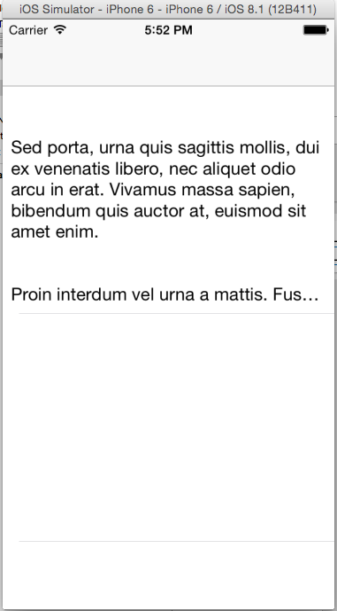
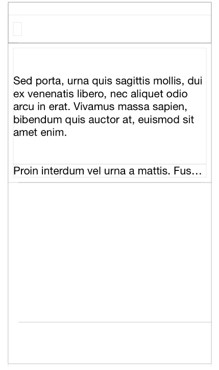

TwoLabelTable
=============

Project demonstrating the issue with Auto Layout and two UILabels in a UITableviewCell

This project has a UITableViewController that is set up to use dynamic height. The UITableViewcell has two UILabels contrainted with Auto Layout. The numberOfLines is set to 0. Ideally both these UILabels should expand to fit the entire text. However the second UILabel just stays a single line. However the result is see it is as below.

The screenshot below shows the UITableViewCell in the XCode View Debugger. From the screen shot it is clear that the height of UITableViewCell is calculated correctly, however the bottom UILabel is not expading to fill the text.

